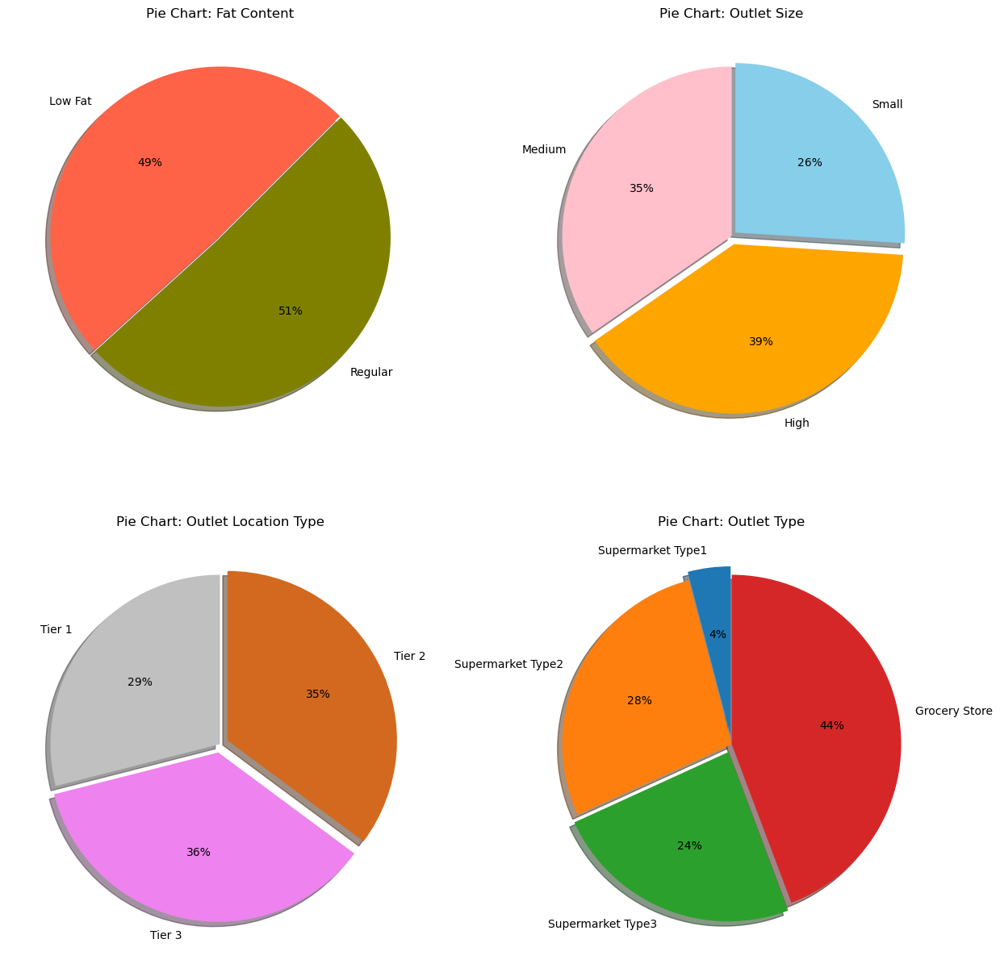
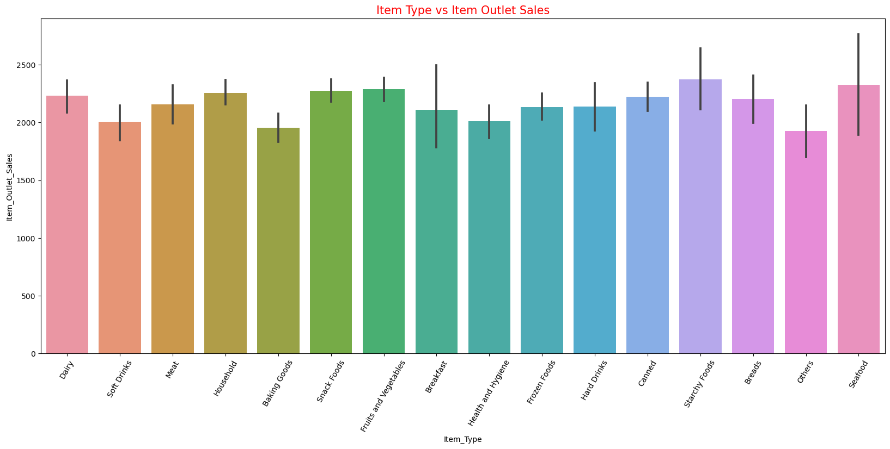
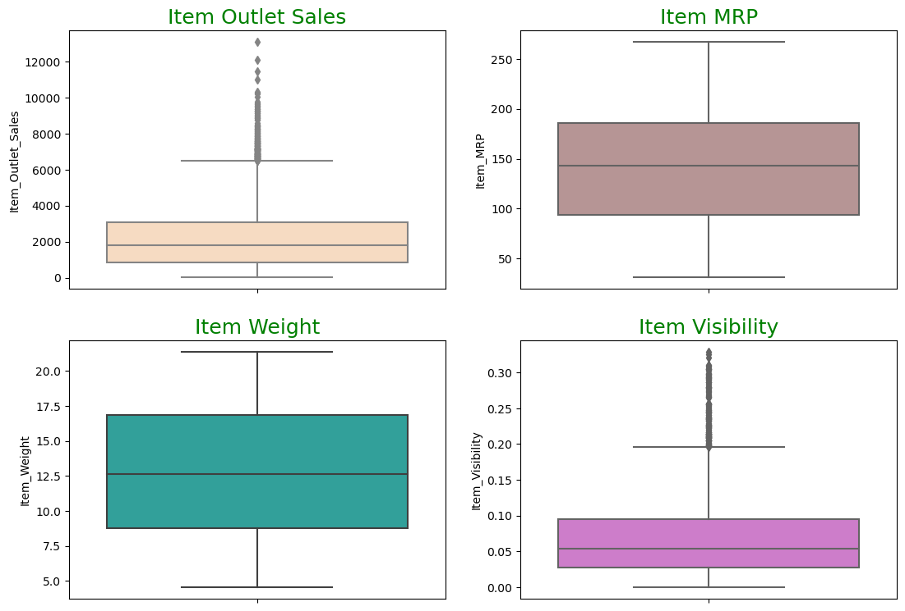
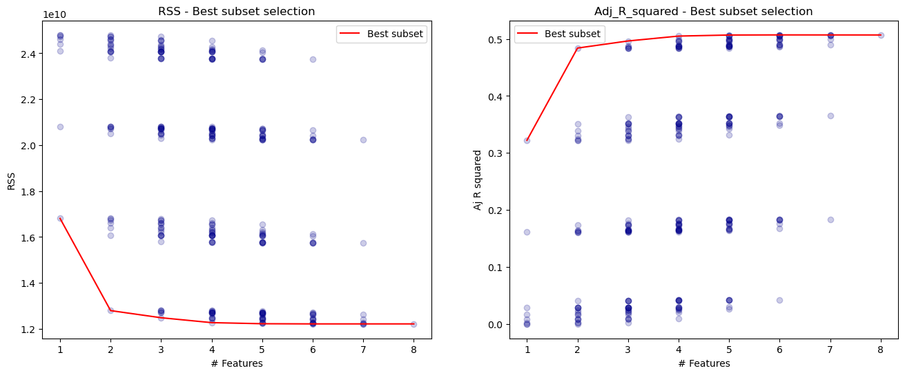

# Big-Mart-Sales-Prediction

### Performed Data Visualization, Regression Analysis and Machine Learning on the Big Mart Sales Prediction Dataset available online.

### Drew inferences from observing trends in the data and also did multiple visualizations to understand the data better.

### Performed Feature Engineering and chose the optimal feature subset to train the Machine Learning Model on.

#### Used a variety of Machine Learning Algorithms on the data and tried to conclude the results of all the different models.

